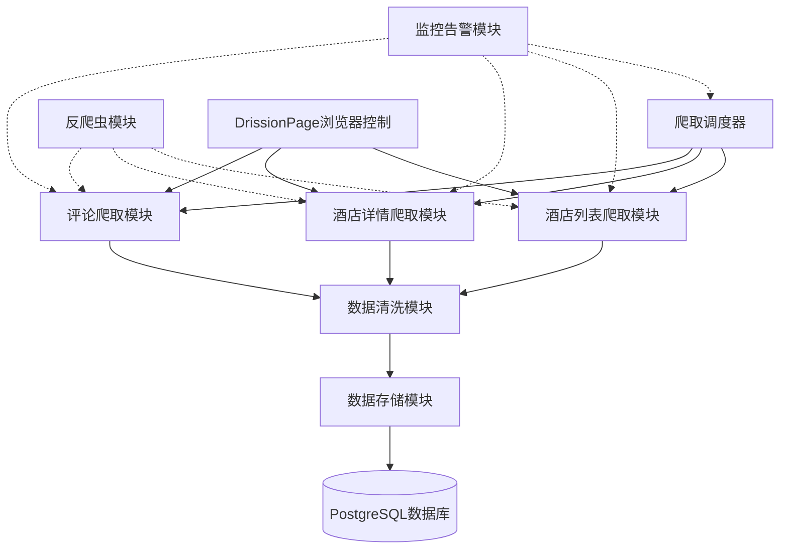
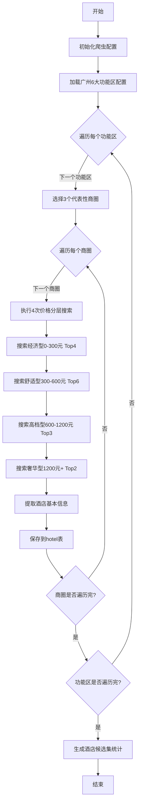
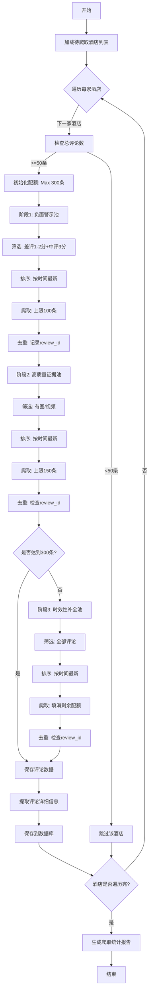
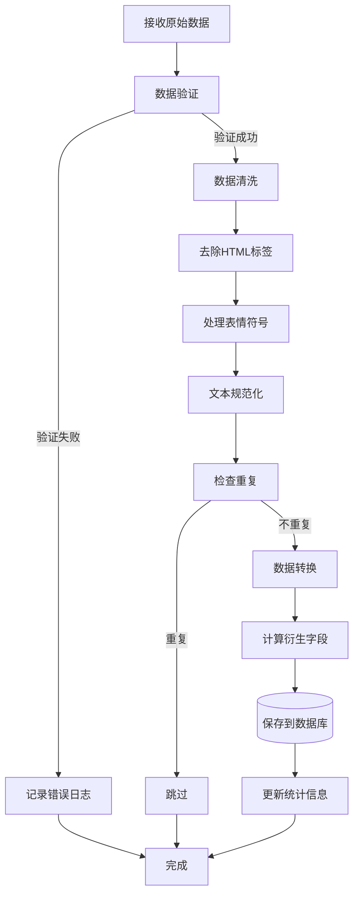

# 飞猪酒店评论爬取完整流程架构

## 一、整体架构设计

### 1.1 系统架构图



### 1.2 技术栈选型

| 组件 | 技术选型 | 说明 |
|------|---------|------|
| **爬虫框架** | DrissionPage | 基于CDP协议，绕过webdriver检测 |
| **浏览器** | Chrome (Debug模式) | 手动登录后接管 |
| **数据库** | PostgreSQL + pgvector | 支持向量检索 |
| **ORM** | SQLAlchemy | Python ORM框架 |
| **任务调度** | APScheduler | 定时任务调度 |
| **日志** | Loguru | 简洁的日志库 |
| **配置管理** | Python-dotenv | 环境变量管理 |
| **数据验证** | Pydantic | 数据模型验证 |
| **并发控制** | asyncio + aiohttp | 异步IO |

## 二、爬取流程设计

### 2.1 阶段一：酒店候选集构建

#### 流程图



#### 实现细节

**1. 区域配置数据结构**

```python
GUANGZHOU_REGIONS = {
    "CBD商务区": {
        "business_zones": [
            {"name": "珠江新城/五羊新城商圈", "code": "39584"},
            {"name": "火车东站/天河体育中心商圈", "code": "39585"},
            {"name": "天河公园/东圃商圈", "code": "39586"}
        ],
        "price_ranges": [
            {"level": "R2", "min": 100, "max": 300, "top_n": 4, "sort": "rating"},
            {"level": "R3", "min": 300, "max": 600, "top_n": 6, "sort": "sales"},
            {"level": "R4", "min": 600, "max": 1200, "top_n": 3, "sort": "sales"},
            {"level": "R5", "min": 1200, "max": 9999, "top_n": 2, "sort": "comprehensive"}
        ]
    },
    "老城文化区": {
        # ... 类似结构
    },
    # ... 其他功能区
}
```

**2. 搜索URL构造**

```python
def build_search_url(city_code, business_zone, price_level, check_in, check_out, page=1):
    """
    构造搜索URL
    
    示例URL:
    https://hotel.fliggy.com/hotel_list3.htm?
        city=440100&
        keywords=&
        checkIn=2026-01-26&
        checkOut=2026-01-27&
        location=39584&  # 商圈代码
        jgR3&  # 价格档次
        pg=1  # 页码
    """
    base_url = "https://hotel.fliggy.com/hotel_list3.htm"
    params = {
        "city": city_code,
        "checkIn": check_in,
        "checkOut": check_out,
        "location": business_zone,
        f"jg{price_level}": "",
        "pg": page
    }
    return f"{base_url}?{'&'.join(f'{k}={v}' for k, v in params.items())}"
```

**3. 酒店信息提取**

由于HTML中酒店列表是动态加载的，需要：
- 等待页面加载完成
- 提取JavaScript中的数据（可能在`window.__INITIAL_STATE__`或类似变量中）
- 或者通过抓包分析AJAX接口

```python
async def extract_hotel_list(page):
    """
    从页面提取酒店列表
    
    可能的数据来源：
    1. JavaScript变量中的JSON数据
    2. AJAX接口返回的数据
    """
    # 方案1：从JavaScript变量提取
    hotel_data = page.run_js("return window.__INITIAL_STATE__.hotelList")
    
    # 方案2：等待元素加载后提取
    # hotels = page.eles('.hotel-item')
    
    return parse_hotel_data(hotel_data)
```

### 2.2 阶段二：评论详情采集

#### 流程图



#### 实现细节

**1. 评论筛选参数**

```python
REVIEW_FILTERS = {
    "negative_pool": {
        "rate_score": 2,  # 差评+中评
        "sort": "time",  # 按时间排序
        "max_count": 100,
        "priority": 1
    },
    "evidence_pool": {
        "rate_score": 3,  # 有图
        "sort": "time",
        "max_count": 150,
        "priority": 2
    },
    "latest_pool": {
        "rate_score": 0,  # 全部
        "sort": "time",
        "max_count": None,  # 填满剩余配额
        "priority": 3
    }
}
```

**2. 评论URL构造**

```python
def build_review_url(hotel_id, rate_score, page=1):
    """
    构造评论列表URL（可能是AJAX接口）
    
    预估接口格式:
    https://hotel.fliggy.com/ajax/getReviews.do?
        hid=3472&
        rateScore=2&  # 0-全部, 1-好评, 2-差评, 3-有图
        page=1&
        pageSize=20
    """
    return f"https://hotel.fliggy.com/ajax/getReviews.do?hid={hotel_id}&rateScore={rate_score}&page={page}"
```

**3. 评论数据提取**

```python
def extract_review_data(review_element):
    """
    从HTML元素提取评论数据
    """
    return {
        "review_id": extract_review_id(review_element),
        "user_name": review_element.ele('.tb-r-buyer').text,
        "content": review_element.ele('.tb-r-cnt').text,
        "comment_tags": review_element.ele('.comment-name').text,
        "create_time": parse_time(review_element.ele('.tb-r-date').text),
        "score_clean": extract_star_score(review_element, "清洁程度"),
        "score_service": extract_star_score(review_element, "服务体验"),
        "score_value": extract_star_score(review_element, "性价比"),
        "has_images": bool(review_element.eles('.tb-r-photos')),
        "image_urls": extract_image_urls(review_element),
        "reply_content": extract_reply(review_element),
        "reply_time": extract_reply_time(review_element)
    }

def extract_star_score(element, score_type):
    """
    从星级评分中提取分数
    
    HTML结构:
    <span class="stars">★★★★★<em style="width:100%">★★★★★</em></span>
    
    width:100% = 5星
    width:80% = 4星
    width:60% = 3星
    width:40% = 2星
    width:20% = 1星
    """
    score_element = element.ele(f'li:contains("{score_type}") .stars em')
    if score_element:
        width_str = score_element.attr('style')
        # 提取width值，如 "width:100%" -> 100
        width = int(width_str.split(':')[1].replace('%', '').strip())
        return round(width / 20)  # 转换为1-5星
    return None
```

### 2.3 阶段三：数据清洗与存储

#### 流程图



#### 实现细节

**1. 数据验证模型（Pydantic）**

```python
from pydantic import BaseModel, validator
from datetime import datetime
from typing import Optional, List

class ReviewModel(BaseModel):
    review_id: int
    hotel_id: int
    user_name: str
    content: str
    comment_tags: Optional[str]
    create_time: datetime
    score_clean: Optional[int]
    score_service: Optional[int]
    score_value: Optional[int]
    has_images: bool = False
    image_urls: List[str] = []
    reply_content: Optional[str]
    reply_time: Optional[datetime]
    
    @validator('content')
    def content_not_empty(cls, v):
        if not v or len(v.strip()) < 10:
            raise ValueError('评论内容过短')
        return v.strip()
    
    @validator('score_clean', 'score_service', 'score_value')
    def score_range(cls, v):
        if v is not None and (v < 1 or v > 5):
            raise ValueError('评分必须在1-5之间')
        return v
    
    @property
    def score_avg(self):
        scores = [s for s in [self.score_clean, self.score_service, self.score_value] if s is not None]
        return round(sum(scores) / len(scores), 1) if scores else None
    
    @property
    def content_length(self):
        return len(self.content)
```

**2. 数据清洗函数**

```python
import re
from html import unescape

def clean_text(text: str) -> str:
    """
    清洗文本内容
    """
    if not text:
        return ""
    
    # 1. HTML实体解码
    text = unescape(text)
    
    # 2. 去除HTML标签
    text = re.sub(r'<[^>]+>', '', text)
    
    # 3. 处理表情符号（保留或转换）
    # 选项1: 保留表情
    # 选项2: 移除表情
    # text = re.sub(r'[\U00010000-\U0010ffff]', '', text)
    
    # 4. 规范化空白字符
    text = re.sub(r'\s+', ' ', text)
    
    # 5. 去除首尾空白
    text = text.strip()
    
    return text

def extract_tags_from_comment_name(comment_name: str) -> List[str]:
    """
    从comment-name中提取标签
    
    输入: "#服务热心,#停车方便 🛏床"
    输出: ["服务热心", "停车方便", "床"]
    """
    if not comment_name:
        return []
    
    # 提取#标签
    tags = re.findall(r'#([^#,，\s]+)', comment_name)
    
    # 提取emoji后的文字
    emoji_tags = re.findall(r'[\U00010000-\U0010ffff]\s*([^\s,，]+)', comment_name)
    
    return list(set(tags + emoji_tags))
```

## 三、反爬虫策略

### 3.1 核心策略

| 策略 | 实现方式 | 说明 |
|------|---------|------|
| **浏览器接管** | DrissionPage + Chrome Debug模式 | 手动登录后接管，继承Cookie |
| **随机延迟** | random.uniform(3, 6)秒 | 模拟人类阅读时间 |
| **User-Agent轮换** | 随机选择常见UA | 避免单一UA被识别 |
| **代理IP池** | 可选，按需配置 | 高频爬取时使用 |
| **滑块验证处理** | 自动尝试 + 人工兜底 | 检测到滑块时暂停等待人工 |
| **请求频率控制** | 令牌桶算法 | 控制每分钟请求数 |
| **会话保持** | 复用同一浏览器实例 | 保持登录状态 |

### 3.2 实现代码

```python
from DrissionPage import ChromiumPage
import random
import time
from typing import Optional

class AntiCrawler:
    def __init__(self):
        self.page: Optional[ChromiumPage] = None
        self.last_request_time = 0
        self.min_interval = 3  # 最小间隔3秒
        self.max_interval = 6  # 最大间隔6秒
        
    def init_browser(self, debug_port=9222):
        """
        初始化浏览器（接管已登录的Chrome）
        """
        self.page = ChromiumPage(addr_or_opts=f'127.0.0.1:{debug_port}')
        return self.page
    
    def random_delay(self):
        """
        随机延迟
        """
        delay = random.uniform(self.min_interval, self.max_interval)
        time.sleep(delay)
    
    def check_and_handle_captcha(self):
        """
        检查并处理验证码
        """
        # 检测滑块验证码
        captcha = self.page.ele('#nc_1_n1z', timeout=2)
        if captcha:
            print("检测到滑块验证码，尝试自动处理...")
            try:
                # 尝试自动拖拽
                self.auto_slide_captcha(captcha)
                time.sleep(2)
                
                # 检查是否成功
                if self.page.ele('#nc_1_n1z', timeout=1):
                    print("自动处理失败，请手动完成验证...")
                    input("完成验证后按Enter继续...")
            except Exception as e:
                print(f"自动处理验证码失败: {e}")
                input("请手动完成验证后按Enter继续...")
    
    def auto_slide_captcha(self, captcha_element):
        """
        自动拖拽滑块（简单实现）
        """
        # 获取滑块位置
        rect = captcha_element.rect
        
        # 模拟人类拖拽：分段移动
        total_distance = 300  # 预估距离
        steps = random.randint(15, 25)
        
        for i in range(steps):
            distance = total_distance / steps
            captcha_element.drag(distance, 0, duration=random.uniform(0.1, 0.3))
            time.sleep(random.uniform(0.01, 0.05))
```

### 3.3 错误处理与重试

```python
from tenacity import retry, stop_after_attempt, wait_exponential

class CrawlerWithRetry:
    @retry(
        stop=stop_after_attempt(3),  # 最多重试3次
        wait=wait_exponential(multiplier=1, min=4, max=10)  # 指数退避
    )
    def fetch_with_retry(self, url):
        """
        带重试的请求
        """
        try:
            self.anti_crawler.random_delay()
            self.page.get(url)
            self.anti_crawler.check_and_handle_captcha()
            return self.page.html
        except Exception as e:
            print(f"请求失败: {e}")
            raise
```

## 四、监控与日志

### 4.1 日志配置

```python
from loguru import logger
import sys

# 配置日志
logger.remove()  # 移除默认handler

# 控制台输出
logger.add(
    sys.stdout,
    format="<green>{time:YYYY-MM-DD HH:mm:ss}</green> | <level>{level: <8}</level> | <cyan>{name}</cyan>:<cyan>{function}</cyan>:<cyan>{line}</cyan> - <level>{message}</level>",
    level="INFO"
)

# 文件输出
logger.add(
    "logs/crawler_{time:YYYY-MM-DD}.log",
    rotation="00:00",  # 每天轮转
    retention="30 days",  # 保留30天
    compression="zip",  # 压缩
    level="DEBUG"
)

# 错误日志单独记录
logger.add(
    "logs/error_{time:YYYY-MM-DD}.log",
    rotation="00:00",
    retention="90 days",
    level="ERROR"
)
```

### 4.2 进度监控

```python
from tqdm import tqdm

class ProgressMonitor:
    def __init__(self, total_hotels):
        self.total_hotels = total_hotels
        self.completed_hotels = 0
        self.total_reviews = 0
        self.failed_hotels = []
        
        self.pbar = tqdm(total=total_hotels, desc="爬取进度")
    
    def update_hotel(self, hotel_id, review_count, success=True):
        """
        更新酒店爬取进度
        """
        self.completed_hotels += 1
        self.total_reviews += review_count
        
        if not success:
            self.failed_hotels.append(hotel_id)
        
        self.pbar.update(1)
        self.pbar.set_postfix({
            "评论数": self.total_reviews,
            "失败数": len(self.failed_hotels)
        })
    
    def get_summary(self):
        """
        获取爬取摘要
        """
        return {
            "total_hotels": self.total_hotels,
            "completed_hotels": self.completed_hotels,
            "total_reviews": self.total_reviews,
            "failed_hotels": len(self.failed_hotels),
            "success_rate": f"{(self.completed_hotels - len(self.failed_hotels)) / self.total_hotels * 100:.2f}%"
        }
```

## 五、项目目录结构

```
HotelReviewCrawler/
├── config/
│   ├── __init__.py
│   ├── settings.py          # 配置文件
│   └── regions.py           # 区域配置
├── crawler/
│   ├── __init__.py
│   ├── hotel_list.py        # 酒店列表爬虫
│   ├── hotel_detail.py      # 酒店详情爬虫
│   ├── review.py            # 评论爬虫
│   └── anti_crawler.py      # 反爬虫模块
├── database/
│   ├── __init__.py
│   ├── models.py            # ORM模型
│   ├── connection.py        # 数据库连接
│   └── init_db.sql          # 初始化SQL
├── utils/
│   ├── __init__.py
│   ├── cleaner.py           # 数据清洗
│   ├── validator.py         # 数据验证
│   └── logger.py            # 日志配置
├── scheduler/
│   ├── __init__.py
│   └── task_scheduler.py    # 任务调度
├── logs/                    # 日志目录
├── data/                    # 数据目录
├── main.py                  # 主程序入口
├── requirements.txt         # 依赖包
└── README.md               # 项目说明
```

## 六、执行计划

### 6.1 时间安排

| 阶段 | 任务 | 预计时间 |
|------|------|---------|
| **准备阶段** | 环境搭建、数据库初始化 | 0.5天 |
| **开发阶段** | 编写爬虫代码 | 2天 |
| **测试阶段** | 小规模测试、调试 | 1天 |
| **爬取阶段** | 正式爬取数据 | 2-3天 |
| **验证阶段** | 数据质量检查 | 0.5天 |

### 6.2 风险控制

| 风险 | 应对措施 |
|------|---------|
| **账号被封** | 准备多个账号轮换 |
| **IP被封** | 使用代理IP池 |
| **验证码频繁** | 降低爬取频率，增加人工介入 |
| **数据丢失** | 实时备份，断点续爬 |
| **网络不稳定** | 实现重试机制 |

## 七、下一步工作

1. ✅ 完成爬取流程架构设计
2. ⏭️ 编写具体的爬虫代码
3. ⏭️ 实现数据库ORM模型
4. ⏭️ 开发任务调度系统
5. ⏭️ 进行小规模测试
