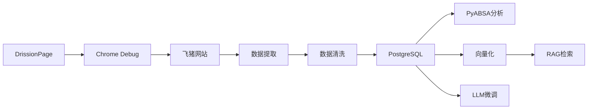

# 飞猪酒店评论爬取综合实施方案

## 一、项目概述

### 1.1 项目目标
构建一个**高信噪比、分布均衡、覆盖全面**的广州市酒店评论知识库，用于支持：
1. 基于RAG的酒店推荐智能体
2. 微量规模LLM的领域微调
3. 方面级情感分析（ABSA）研究

### 1.2 数据规模目标
- **酒店样本**: 250-270家
- **评论样本**: 75,000-81,000条
- **覆盖区域**: 广州市6大核心功能区
- **价格分布**: 100元以下至1500元以上，全价位覆盖

### 1.3 技术栈总览



## 二、关键技术难点与解决方案

### 2.1 难点一：动态加载的酒店列表

**问题描述**:
- 酒店列表数据通过JavaScript动态渲染
- HTML源代码中不包含完整的酒店信息

**解决方案**:

**方案A: 抓包分析AJAX接口（推荐）**

1. 使用浏览器开发者工具（F12）-> Network标签
2. 筛选XHR请求，找到酒店列表API
3. 分析请求参数和响应格式
4. 直接调用API获取JSON数据

```python
# 预估的API接口格式
def fetch_hotel_list_api(city_code, business_zone, price_level, page=1):
    """
    直接调用API获取酒店列表
    """
    url = "https://hotel.fliggy.com/api/search/hotelList"
    params = {
        "cityCode": city_code,
        "businessZone": business_zone,
        "priceLevel": price_level,
        "page": page,
        "pageSize": 20
    }
    headers = {
        "User-Agent": "Mozilla/5.0...",
        "Referer": "https://hotel.fliggy.com/",
        "Cookie": "your_cookie_here"
    }
    
    response = requests.get(url, params=params, headers=headers)
    return response.json()
```

**方案B: 等待页面渲染后提取**

```python
def extract_hotel_from_page(page):
    """
    等待页面加载完成后提取
    """
    # 等待酒店列表加载
    page.wait.ele_loaded('.hotel-item', timeout=10)
    
    # 提取所有酒店元素
    hotels = page.eles('.hotel-item')
    
    hotel_list = []
    for hotel in hotels:
        hotel_data = {
            "hotel_id": hotel.attr('data-hotel-id'),
            "hotel_name": hotel.ele('.hotel-name').text,
            "price": extract_price(hotel.ele('.price')),
            "rating": hotel.ele('.rating').text,
            # ... 其他字段
        }
        hotel_list.append(hotel_data)
    
    return hotel_list
```

**方案C: 执行JavaScript获取数据**

```python
def extract_from_js_variable(page):
    """
    从JavaScript变量中提取数据
    """
    # 尝试从window对象中获取数据
    hotel_data = page.run_js("""
        return window.__INITIAL_STATE__ || 
               window.hotelListData || 
               window.searchResult;
    """)
    
    if hotel_data:
        return parse_hotel_data(hotel_data)
    return None
```

### 2.2 难点二：评论分页加载机制

**问题描述**:
- 评论通过AJAX分页加载
- 需要确定评论API接口和分页参数

**解决方案**:

**步骤1: 抓包分析评论API**

预估的评论API格式：
```
GET https://hotel.fliggy.com/ajax/getReviews.do
参数:
- hid: 酒店ID (如: 3472)
- rateScore: 评分筛选 (0-全部, 1-好评, 2-差评, 3-有图)
- page: 页码
- pageSize: 每页数量 (通常20条)
```

**步骤2: 实现分页爬取**

```python
async def crawl_reviews_by_filter(hotel_id, rate_score, max_count):
    """
    按筛选条件爬取评论
    
    Args:
        hotel_id: 酒店ID
        rate_score: 0-全部, 1-好评, 2-差评, 3-有图
        max_count: 最大爬取数量
    """
    reviews = []
    page = 1
    review_ids = set()  # 用于去重
    
    while len(reviews) < max_count:
        # 构造请求
        url = build_review_url(hotel_id, rate_score, page)
        
        # 发送请求
        response = await fetch_with_retry(url)
        data = response.json()
        
        # 解析评论
        page_reviews = data.get('reviews', [])
        if not page_reviews:
            break  # 没有更多评论
        
        # 去重并添加
        for review in page_reviews:
            review_id = review['reviewId']
            if review_id not in review_ids:
                review_ids.add(review_id)
                reviews.append(review)
                
                if len(reviews) >= max_count:
                    break
        
        page += 1
        await asyncio.sleep(random.uniform(1, 2))  # 随机延迟
    
    return reviews[:max_count]
```

**步骤3: 实现瀑布流采集策略**

```python
async def waterfall_crawl_reviews(hotel_id, total_review_count):
    """
    瀑布流采集策略
    
    1. 负面警示池: 差评+中评, 最多100条
    2. 高质量证据池: 有图评论, 最多150条
    3. 时效性补全池: 全部评论, 填满剩余配额
    """
    all_reviews = []
    review_ids = set()
    target_count = min(300, total_review_count)
    
    # 阶段1: 负面警示池
    logger.info(f"酒店{hotel_id}: 开始爬取负面警示池...")
    negative_reviews = await crawl_reviews_by_filter(
        hotel_id, rate_score=2, max_count=100
    )
    for review in negative_reviews:
        if review['reviewId'] not in review_ids:
            review_ids.add(review['reviewId'])
            all_reviews.append(review)
    
    logger.info(f"负面警示池: 获取{len(negative_reviews)}条")
    
    # 阶段2: 高质量证据池
    if len(all_reviews) < target_count:
        logger.info(f"酒店{hotel_id}: 开始爬取高质量证据池...")
        image_reviews = await crawl_reviews_by_filter(
            hotel_id, rate_score=3, max_count=150
        )
        for review in image_reviews:
            if review['reviewId'] not in review_ids:
                review_ids.add(review['reviewId'])
                all_reviews.append(review)
                if len(all_reviews) >= target_count:
                    break
        
        logger.info(f"高质量证据池: 新增{len(all_reviews) - len(negative_reviews)}条")
    
    # 阶段3: 时效性补全池
    if len(all_reviews) < target_count:
        logger.info(f"酒店{hotel_id}: 开始爬取时效性补全池...")
        remaining = target_count - len(all_reviews)
        latest_reviews = await crawl_reviews_by_filter(
            hotel_id, rate_score=0, max_count=remaining
        )
        for review in latest_reviews:
            if review['reviewId'] not in review_ids:
                review_ids.add(review['reviewId'])
                all_reviews.append(review)
                if len(all_reviews) >= target_count:
                    break
        
        logger.info(f"时效性补全池: 新增{len(all_reviews) - len(negative_reviews) - len(image_reviews)}条")
    
    logger.info(f"酒店{hotel_id}: 总计获取{len(all_reviews)}条评论")
    return all_reviews
```

### 2.3 难点三：评分提取

**问题描述**:
- 评分通过CSS样式的width属性表示
- 需要准确解析星级评分

**解决方案**:

```python
def extract_star_score(review_html, score_type):
    """
    提取星级评分
    
    HTML结构:
    <li>
        <span>清洁程度:</span>
        <span class="stars">
            ★★★★★
            <em style="width:100%">★★★★★</em>
        </span>
    </li>
    
    width映射:
    - 100% -> 5星
    - 80% -> 4星
    - 60% -> 3星
    - 40% -> 2星
    - 20% -> 1星
    """
    # 方案1: 使用BeautifulSoup
    from bs4 import BeautifulSoup
    soup = BeautifulSoup(review_html, 'html.parser')
    
    # 找到对应的评分项
    score_item = soup.find('li', text=lambda t: t and score_type in t)
    if not score_item:
        return None
    
    # 提取em标签的style属性
    em = score_item.find('em')
    if not em or 'style' not in em.attrs:
        return None
    
    # 解析width值
    style = em['style']
    match = re.search(r'width:\s*(\d+)%', style)
    if match:
        width = int(match.group(1))
        return round(width / 20)  # 转换为1-5星
    
    return None

# 方案2: 使用正则表达式
def extract_star_score_regex(review_html, score_type):
    """
    使用正则表达式提取评分
    """
    pattern = rf'{score_type}.*?<em\s+style="width:(\d+)%">'
    match = re.search(pattern, review_html)
    if match:
        width = int(match.group(1))
        return round(width / 20)
    return None
```

### 2.4 难点四：反爬虫对抗

**问题描述**:
- 飞猪有滑块验证码
- 高频请求可能触发IP封禁
- 需要保持登录状态

**解决方案**:

**1. 使用DrissionPage接管已登录浏览器**

```bash
# 启动Chrome调试模式
chrome.exe --remote-debugging-port=9222 --user-data-dir="C:\selenium\automation_profile"
```

```python
from DrissionPage import ChromiumPage

# 连接到已打开的浏览器
page = ChromiumPage(addr_or_opts='127.0.0.1:9222')

# 手动登录后，脚本自动继承登录状态
page.get('https://hotel.fliggy.com/')
```

**2. 实现智能延迟策略**

```python
class SmartDelay:
    def __init__(self):
        self.base_delay = 3  # 基础延迟3秒
        self.max_delay = 10  # 最大延迟10秒
        self.error_count = 0  # 错误计数
    
    def wait(self):
        """
        根据错误次数动态调整延迟
        """
        if self.error_count == 0:
            delay = random.uniform(self.base_delay, self.base_delay + 3)
        else:
            # 出现错误后，延迟时间指数增长
            delay = min(
                self.base_delay * (2 ** self.error_count),
                self.max_delay
            )
        
        logger.debug(f"等待 {delay:.2f} 秒...")
        time.sleep(delay)
    
    def on_success(self):
        """请求成功，重置错误计数"""
        self.error_count = max(0, self.error_count - 1)
    
    def on_error(self):
        """请求失败，增加错误计数"""
        self.error_count += 1
```

**3. 滑块验证码处理**

```python
def handle_slider_captcha(page):
    """
    处理滑块验证码
    """
    # 检测滑块
    slider = page.ele('#nc_1_n1z', timeout=2)
    if not slider:
        return True  # 没有验证码
    
    logger.warning("检测到滑块验证码")
    
    # 尝试自动处理
    try:
        # 获取滑块和轨道
        slider_button = slider.ele('.nc-lang-cnt')
        
        # 模拟人类拖拽
        # 1. 快速移动到80%
        slider_button.drag(240, 0, duration=0.3)
        time.sleep(0.1)
        
        # 2. 慢速移动到100%
        slider_button.drag(60, 0, duration=0.5)
        time.sleep(1)
        
        # 检查是否成功
        if not page.ele('#nc_1_n1z', timeout=2):
            logger.info("自动处理验证码成功")
            return True
    except Exception as e:
        logger.error(f"自动处理验证码失败: {e}")
    
    # 自动处理失败，等待人工
    logger.warning("请手动完成滑块验证...")
    input("完成后按Enter继续...")
    return True
```

## 三、完整实施流程

### 3.1 环境准备

**步骤1: 安装依赖**

```bash
# 创建虚拟环境
python -m venv venv
source venv/bin/activate  # Linux/Mac
# 或
venv\Scripts\activate  # Windows

# 安装依赖
pip install DrissionPage
pip install sqlalchemy psycopg2-binary
pip install pydantic
pip install loguru
pip install tqdm
pip install tenacity
pip install python-dotenv
```

**步骤2: 配置数据库**

```bash
# 安装PostgreSQL
# 创建数据库
createdb hotel_reviews

# 安装pgvector扩展
psql -d hotel_reviews -c "CREATE EXTENSION vector;"

# 执行初始化SQL
psql -d hotel_reviews -f database/init_db.sql
```

**步骤3: 配置Chrome调试模式**

```bash
# Windows
"C:\Program Files\Google\Chrome\Application\chrome.exe" --remote-debugging-port=9222 --user-data-dir="C:\selenium\automation_profile"

# Mac
/Applications/Google\ Chrome.app/Contents/MacOS/Google\ Chrome --remote-debugging-port=9222 --user-data-dir="/tmp/chrome_debug"

# Linux
google-chrome --remote-debugging-port=9222 --user-data-dir="/tmp/chrome_debug"
```

**步骤4: 手动登录飞猪**

1. 在调试模式的Chrome中访问 https://www.fliggy.com/
2. 点击登录，使用支付宝扫码登录
3. 确认登录成功后，保持浏览器打开

### 3.2 执行爬取

**步骤1: 测试连接**

```python
# test_connection.py
from DrissionPage import ChromiumPage

page = ChromiumPage(addr_or_opts='127.0.0.1:9222')
page.get('https://hotel.fliggy.com/')

# 检查是否已登录
if page.ele('.login-info', timeout=5):
    print("✓ 已登录")
else:
    print("✗ 未登录，请先手动登录")
```

**步骤2: 小规模测试**

```python
# 测试爬取1个商圈的酒店
python main.py --mode test --region "CBD商务区" --zone "珠江新城/五羊新城商圈" --max-hotels 5
```

**步骤3: 正式爬取**

```python
# 爬取所有酒店列表
python main.py --mode hotel_list

# 爬取所有评论
python main.py --mode reviews --max-reviews-per-hotel 300
```

### 3.3 数据验证

**步骤1: 统计数据**

```sql
-- 检查酒店数量
SELECT COUNT(*) as hotel_count FROM hotel;

-- 检查评论数量
SELECT COUNT(*) as review_count FROM review;

-- 检查各功能区分布
SELECT district, COUNT(*) as count 
FROM hotel 
GROUP BY district 
ORDER BY count DESC;

-- 检查价格分布
SELECT price_level, COUNT(*) as count 
FROM hotel 
GROUP BY price_level 
ORDER BY price_level;

-- 检查评论分布
SELECT 
    h.hotel_name,
    COUNT(r.review_id) as review_count,
    AVG(r.score_avg) as avg_score
FROM hotel h
LEFT JOIN review r ON h.hotel_id = r.hotel_id
GROUP BY h.hotel_id, h.hotel_name
ORDER BY review_count DESC
LIMIT 20;
```

**步骤2: 数据质量检查**

```python
# check_data_quality.py
def check_data_quality():
    """
    检查数据质量
    """
    issues = []
    
    # 1. 检查空值
    null_content = session.query(Review).filter(
        Review.content == None
    ).count()
    if null_content > 0:
        issues.append(f"发现{null_content}条评论内容为空")
    
    # 2. 检查评分范围
    invalid_scores = session.query(Review).filter(
        or_(
            Review.score_clean < 1,
            Review.score_clean > 5,
            Review.score_service < 1,
            Review.score_service > 5
        )
    ).count()
    if invalid_scores > 0:
        issues.append(f"发现{invalid_scores}条评分异常")
    
    # 3. 检查重复
    duplicates = session.query(
        Review.review_id, 
        func.count(Review.review_id)
    ).group_by(Review.review_id).having(
        func.count(Review.review_id) > 1
    ).count()
    if duplicates > 0:
        issues.append(f"发现{duplicates}条重复评论")
    
    # 4. 检查时间异常
    future_reviews = session.query(Review).filter(
        Review.create_time > datetime.now()
    ).count()
    if future_reviews > 0:
        issues.append(f"发现{future_reviews}条未来时间的评论")
    
    return issues
```

## 四、后续数据处理流程

### 4.1 方面级情感分析（PyABSA）

```python
from pyabsa import ATEPCCheckpointManager

# 加载预训练模型
aspect_extractor = ATEPCCheckpointManager.get_aspect_extractor(
    checkpoint='chinese'
)

# 批量分析评论
def analyze_reviews_batch(reviews):
    """
    批量进行方面级情感分析
    """
    results = []
    for review in reviews:
        # 分析评论
        result = aspect_extractor.extract_aspect(
            inference_source=[review.content],
            save_result=False,
            print_result=False
        )
        
        # 解析结果
        for aspect in result:
            aspect_data = {
                'review_id': review.review_id,
                'hotel_id': review.hotel_id,
                'aspect_term': aspect['aspect'],
                'opinion_term': aspect['opinion'],
                'sentiment': aspect['sentiment'],
                'confidence': aspect['confidence']
            }
            results.append(aspect_data)
    
    return results

# 保存到数据库
def save_aspect_opinions(aspect_opinions):
    """
    保存方面情感分析结果
    """
    for ao in aspect_opinions:
        aspect_opinion = AspectOpinion(**ao)
        session.add(aspect_opinion)
    session.commit()
```

### 4.2 向量化（BGE-small-zh）

```python
from sentence_transformers import SentenceTransformer

# 加载模型
model = SentenceTransformer('BAAI/bge-small-zh')

# 向量化评论
def vectorize_reviews(reviews):
    """
    将评论转换为向量
    """
    texts = [r.content for r in reviews]
    embeddings = model.encode(texts, show_progress_bar=True)
    
    # 保存到数据库
    for review, embedding in zip(reviews, embeddings):
        embedding_record = EmbeddingIndex(
            content_type='review',
            content_id=review.review_id,
            hotel_id=review.hotel_id,
            text_content=review.content,
            text_length=len(review.content),
            embedding=embedding.tolist()
        )
        session.add(embedding_record)
    
    session.commit()
```

### 4.3 生成LLM微调数据

```python
def generate_instruction_data():
    """
    生成指令微调数据
    """
    instruction_data = []
    
    # 从数据库中采样酒店和评论
    hotels = session.query(Hotel).limit(100).all()
    
    for hotel in hotels:
        # 获取该酒店的评论
        reviews = session.query(Review).filter(
            Review.hotel_id == hotel.hotel_id
        ).limit(10).all()
        
        # 构造指令对
        instruction = {
            "instruction": "根据以下酒店评论，推荐适合的酒店",
            "input": generate_user_query(hotel, reviews),
            "output": generate_recommendation(hotel, reviews)
        }
        instruction_data.append(instruction)
    
    # 保存为JSON
    with open('instruction_data.json', 'w', encoding='utf-8') as f:
        json.dump(instruction_data, f, ensure_ascii=False, indent=2)
```

## 五、项目交付物

### 5.1 代码交付物
- [ ] 完整的爬虫代码
- [ ] 数据库初始化脚本
- [ ] 数据清洗脚本
- [ ] 数据分析脚本
- [ ] README文档

### 5.2 数据交付物
- [ ] PostgreSQL数据库备份文件
- [ ] 酒店基础信息CSV
- [ ] 评论数据CSV
- [ ] 方面情感分析结果CSV
- [ ] 向量索引文件

### 5.3 文档交付物
- [ ] 爬取方案设计文档
- [ ] 数据库Schema文档
- [ ] 数据字典
- [ ] 爬取日志和统计报告
- [ ] 数据质量报告

## 六、注意事项与风险提示

### 6.1 法律合规
⚠️ **重要提示**:
1. 仅用于学术研究，不得用于商业用途
2. 遵守robots.txt协议
3. 控制爬取频率，避免对服务器造成压力
4. 不得泄露用户隐私信息

### 6.2 技术风险
1. **账号风险**: 准备多个账号备用
2. **IP风险**: 必要时使用代理IP
3. **数据丢失**: 定期备份数据库
4. **验证码**: 降低频率，增加人工介入

### 6.3 数据质量
1. 定期检查数据完整性
2. 验证评分和时间的合理性
3. 去除重复和无效数据
4. 保留原始数据备份

## 七、总结

本方案提供了一套完整的飞猪酒店评论爬取解决方案，包括：

1. ✅ **HTML结构分析**: 明确了数据提取点
2. ✅ **数据库设计**: 完整的Schema支持后续分析
3. ✅ **爬取流程**: 分层抽样+瀑布流采集策略
4. ✅ **反爬虫策略**: DrissionPage + 智能延迟
5. ✅ **数据处理**: 清洗、验证、向量化流程
6. ✅ **质量保证**: 多层次的数据验证机制

通过本方案，可以高效、稳定地采集到高质量的酒店评论数据，为后续的RAG系统构建和LLM微调提供坚实的数据基础。
